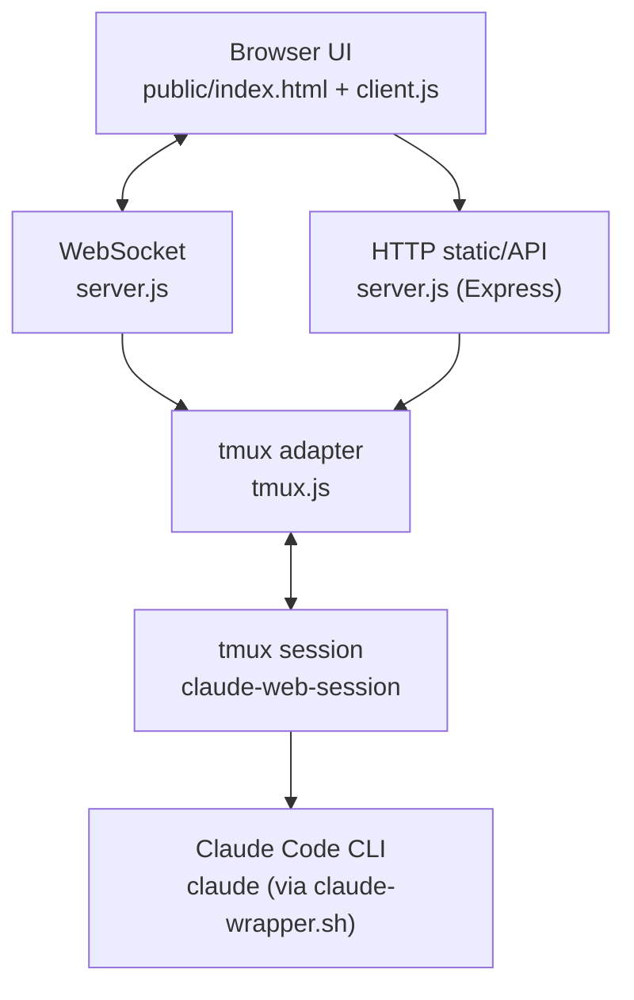
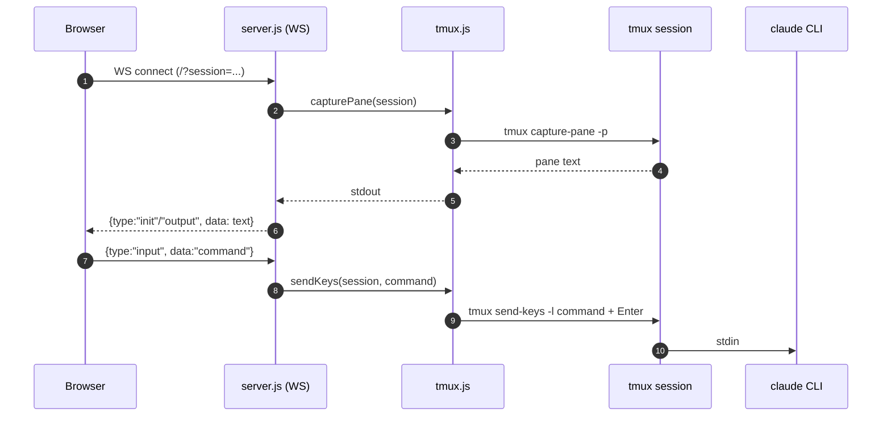

# Repo Review: cc-control (Claude Code Web / tmux-web-control)

> 目标读者：需要在本机通过 Web 远程查看/输入控制 `tmux` 中 Claude Code 的开发者/维护者。  
> 备注：本报告基于仓库当前工作区内容（该仓库 `main` 分支尚无 commit，无法引用 commit SHA）。

## 01. 项目概览

**仓库定位**

- 这是一个本地工具：启动一个 `Express` 静态站点 + `WebSocket` 服务，通过 `tmux` 的 `capture-pane`/`send-keys` 实现“浏览器端镜像终端输出 + 发送输入”，默认面向 `claude` CLI 会话。
- 典型用途：在不直接接触本机终端的情况下（或在手机/另一个浏览器窗口中），查看 Claude Code 输出并下发命令。

**快速指标（基于当前工作区）**

- 主要语言：JavaScript（Node.js）+ HTML/CSS（无构建步骤）
- 关键依赖：`express`、`ws`（见 `package.json`）
- 主要代码文件行数（`wc -l`）：`server.js` 244 行，`tmux.js` 175 行，`public/client.js` 284 行，`public/style.css` 298 行
- 工作区包含：`.git/` 但 `main` 无 commits；包含 `node_modules/`（建议不要提交到 Git）
- 快照（可复现统计）：`docs/_repo_snapshot.md`（由 `scripts/repo_snapshot.py` 生成）

**目录/文件结构（核心部分）**

```
.
├── server.js                 # Node 入口：启动 Web + attach tmux
├── tmux.js                   # tmux 控制封装：会话检查/创建/捕获/发键/终止
├── claude-wrapper.sh         # 启动 claude 的包装：清理嵌套会话相关 env
├── public/                   # 纯静态前端（无打包）
│   ├── index.html
│   ├── client.js
│   └── style.css
└── .claude/settings.local.json  # 本地 Claude 配置（无敏感值）
```

## 02. 架构地图（分层 + 数据流）

### 模块清单

- **Frontend（纯静态）**：`public/index.html` + `public/client.js` + `public/style.css`
- **Backend（Web 服务）**：`server.js`
  - 静态资源：`express.static(public/)`
  - REST API：会话列表/创建/删除（`/api/sessions`）
  - WebSocket：轮询 `tmux capture-pane` 并广播输出；接收输入转发 `tmux send-keys`
- **tmux 适配层**：`tmux.js`（对 `tmux` CLI 的薄封装）
- **Claude CLI 启动包装**：`claude-wrapper.sh`

### Mermaid：模块依赖图



### 数据流（概念）

1. **输入方向**：浏览器输入 → WebSocket `message` → `tmux.sendKeys()` → `tmux send-keys` → Claude/终端
2. **输出方向**：Claude/终端 → `tmux capture-pane` → WebSocket `output` → 浏览器渲染终端快照

## 03. 入口与执行流程（Entrypoint → Critical Path）

### 锚点（Entrypoint）

- Node 入口：`server.js#L243` 调用 `initAndAttachSession()`（`server.js#L61`）
- NPM 启动：`package.json` 的 `start` 脚本执行 `node server.js`

### 初始化与装配（backend）

**启动流程（`server.js`）**

1. 固定配置：端口/默认会话名/轮询间隔（`server.js#L18-L21`）
2. 初始化 Express + 静态资源 + JSON body（`server.js#L23-L30`）
3. `initAndAttachSession()`：
   - `tmux.checkSession(DEFAULT_SESSION)` 判断会话是否存在（`server.js#L67` → `tmux.js#L16`）
   - 不存在则创建会话（`server.js#L69-L94` → `tmux.js#L34`）
   - 通过 `tmux send-keys` 在会话里 `cd` 到当前工作目录（`server.js#L75-L82`）
   - 通过 `tmux send-keys` 执行 `bash claude-wrapper.sh` 启动 `claude`（`server.js#L84-L92` + `claude-wrapper.sh`）
   - 启动 Web Server（`server.js#L99-L101`）
   - 在当前终端 `tmux attach-session`（`server.js#L105-L117`）

### 关键链路（WebSocket 输出/输入）

**WebSocket 输出轮询（`server.js#L160-L216`）**

- 每个 WS 连接创建一个 `setInterval`，间隔 `POLL_INTERVAL=100ms`（`server.js#L20`, `server.js#L179-L192`）
- 每次轮询调用 `tmux.capturePane(sessionName)` 获取整块 pane 文本（`server.js#L183` → `tmux.js#L63`）
- 与 `clientInfo.lastOutput` 比较，不同则推送 `{type:"output"}`（`server.js#L184-L187`）

**WebSocket 输入转发（`server.js#L196-L209`）**

- 浏览器发送 `{type:"input", data:"..."}` → `tmux.sendKeys(sessionName, data)`（`server.js#L198-L204`）
- `tmux.sendKeys` 使用 `spawn('tmux', ['send-keys', ...])` 发送文本，再发送 `Enter`（`tmux.js#L104-L138`）

### Mermaid：执行时序图（关键路径）



## 04. 核心模块深挖（高杠杆模块）

> 本仓库规模较小，按“可维护性/可靠性/安全性”杠杆选择 4 个模块深挖。

### A) `tmux.js`：tmux 控制适配层

**概念与职责**

- 提供统一的 Promise API：会话是否存在、创建、捕获 pane、发送输入、终止会话。

**代码定位**

- `checkSession`：`tmux.js#L16`
- `createSession`：`tmux.js#L34`
- `capturePane`：`tmux.js#L63`
- `sendKeys`：`tmux.js#L90`
- `killSession`：`tmux.js#L151`

**关键实现点**

- `sendKeys` 用 `spawn` 传参数组（`tmux.js#L104-L138`），相对安全且支持特殊字符。
- 其余多个函数使用 `execAsync` 拼接 shell 命令字符串（`tmux.js#L22`, `tmux.js#L48-L51`, `tmux.js#L74-L76`, `tmux.js#L162`）。

**扩展点**

- 将 `execAsync("tmux ...")` 改为 `spawn("tmux", [...])`（或 `execFile`）可显著降低命令注入风险，并更可控地处理返回码/stderr。
- 增加 `validateSessionName(name)`（例如只允许 `[A-Za-z0-9._-]`）可避免 `sessionName` 带引号等字符导致的注入/行为异常。

### B) `server.js`：服务端装配与生命周期

**概念与职责**

- 一次启动同时做两件事：
  1) 保证 `DEFAULT_SESSION` 存在并运行 Claude；
  2) 启动 Web 服务并在当前终端 attach 到 tmux 会话（`server.js#L61-L117`）。

**关键实现点**

- `startWebServer()` 在 `initAndAttachSession()` 内被调用（`server.js#L99-L101`）：这意味着“tmux 初始化失败”会导致 Web 服务也不启动（`server.js#L120-L123`）。
- WebSocket 轮询是“全量 capture + 字符串比较”，对高频输出/多客户端可能有 CPU/内存压力（`server.js#L179-L192`）。

**扩展点**

- 将启动流程拆为“只启动 Web 服务”和“只 attach tmux”两个模式（例如 CLI 参数或环境变量），便于部署/调试。
- `PORT/DEFAULT_SESSION/POLL_INTERVAL` 建议改为环境变量可配置（目前是常量 `server.js#L18-L21`）。

### C) `public/client.js`：终端镜像渲染 + 输入

**概念与职责**

- 将 WS 推送的 pane 快照渲染为 `<pre>`，并提供一个 inline `<input>` 将输入发回服务器。

**关键实现点**

- `cleanOutput()` 清理 ANSI 控制序列并过滤 prompt 噪声（`public/client.js#L50-L85`），提升可读性。
- 断线自动重连（`public/client.js#L207` 后续逻辑，重连间隔 `RECONNECT_INTERVAL=3000ms`）。

**扩展点**

- 增加“会话选择”：通过 `/api/sessions` 获取会话列表，并在连接 WS 时使用 `/?session=...`（与后端 `server.js#L164-L166` 对齐）。
- 增加“只读模式”：禁用输入框，仅做镜像显示（可用于观看/共享）。

### D) `claude-wrapper.sh`：Claude CLI 启动包装

**概念与职责**

- 通过 `unset CLAUDECODE` / `unset CLAUDE_CODE` 避免 Claude Code 对嵌套会话环境的检测导致启动失败（`claude-wrapper.sh` 全文件）。

**扩展点**

- 可加入更明确的依赖检查与错误提示：例如 `command -v claude` 不存在时输出可读错误。

## 05. 上手实操（本地跑起来）

### 最小依赖

- Node.js（README 写明 `>= 14`）
- `tmux >= 3.0`
- 已安装 Claude Code CLI（命令为 `claude`，见 `claude-wrapper.sh`）

### 启动步骤（最小路径）

```bash
cd /Volumes/work/workspace/cc-control
npm install
npm start
```

预期行为：

- 创建/复用 `claude-web-session`（`server.js#L19`）
- 在 tmux 会话里 `cd` 到启动目录，并执行 `bash claude-wrapper.sh` 启动 `claude`（`server.js#L75-L92`）
- Web 服务启动在 `http://localhost:7684`（`server.js#L18`, `server.js#L228-L232`）
- 进程会在当前终端 `tmux attach-session`，可用 `Ctrl+B` 然后 `D` 分离（`server.js#L105-L117`）

### 常见坑与排查

- **没装 tmux**：所有 tmux 相关命令会失败；建议在初始化时显式检查并提示。
- **没装 claude CLI**：`claude-wrapper.sh` 的 `exec claude` 会失败（建议在脚本里加 `command -v` 检查）。
- **局域网暴露风险**：`server.listen(PORT)` 默认会监听 `0.0.0.0`，同网段可能访问到（建议绑定 `127.0.0.1` 或增加认证，见“改进建议”）。

## 06. 二次开发指南（可操作清单）

### 1) 增加鉴权（强烈建议）

目标：避免任何能访问端口的人都能控制本机终端。

- 插入点（HTTP）：在 `app.use(...)` 之后增加简单中间件校验 `Authorization` 或 query token（`server.js#L27-L30` 附近）。
- 插入点（WS）：在 `wss.on('connection', ...)` 内校验 `req.url` 的 token（`server.js#L163-L166` 附近），不通过则 `ws.close()`。

### 2) 默认只监听本机（强烈建议）

- 将 `server.listen(PORT, ...)` 改为 `server.listen(PORT, '127.0.0.1', ...)`（`server.js#L228`）。

### 3) 会话名校验（建议）

- API 创建会话时，校验 `name`（`server.js#L140-L148`），例如只允许 `[A-Za-z0-9._-]{1,64}`。
- `tmux.js` 内也可做二次校验，防止被其他调用路径绕过。

### 4) 输出同步性能优化（建议）

- 当前实现是 100ms 全量 `capture-pane` + 字符串比较（`server.js#L179-L192`）。
- 可选改进方向：
  - 使用 hash（例如 `sha1(stdout)`）降低大字符串比较成本；
  - 降低轮询频率或使用自适应节流（输出变化时加快，否则放慢）；
  - 只捕获最近 N 行（需要调整 tmux 参数与策略）。

## 07. 仓库文档总结

- `README.md` 提供了清晰的功能/架构/启动说明与数据流示意。
- 缺失项（建议补齐）：
  - `.gitignore`（至少忽略 `node_modules/`、日志等）
  - “安全警告”章节：明确这是一个**远程控制本机终端**的工具，必须限制监听地址/增加认证
  - “配置项”章节：PORT/SESSION/POLL_INTERVAL 等（当前硬编码）

## 08. 评分（100 分制，多维度）

> 评分依据：仓库当前体量小、功能聚焦，但安全/可配置/测试与工程化尚未完善。每项给出证据点（文件 + 行号）。

1) 架构清晰度：**8/10**
- 证据：后端/前端/tmux 适配层拆分明确（`server.js`, `tmux.js`, `public/client.js`）。

2) 可扩展性：**6/10**
- 证据：会话参数已通过 WS query 支持（`server.js#L164-L166`），但前端尚未暴露会话选择。
- 改进：配置项 env 化、鉴权插件化。

3) 可维护性：**7/10**
- 证据：文件少、职责集中；但 `tmux.js` 同时使用 `execAsync` 与 `spawn`，风格不一致（`tmux.js#L22` vs `tmux.js#L104`）。

4) 可靠性与错误处理：**6/10**
- 证据：多数 tmux 调用失败时会返回 false/null 或抛错；WebSocket 轮询有 `isPolling` 防重入（`server.js#L179-L191`）。
- 缺口：对 tmux/claude 缺失的前置检查与用户可读错误。

5) 可观测性：**5/10**
- 证据：只有 console log（`server.js#L65` 等）；没有结构化日志/请求 ID。

6) 文档质量：**7/10**
- 证据：README 提供架构图与启动方式；但缺少安全提示（`README.md` 未显式强调风险）。

7) 示例与教程：**6/10**
- 证据：最小启动路径清晰；但无更多场景（多会话、只读、远端访问）示例。

8) 测试与 CI：**2/10**
- 证据：未发现测试/CI 配置；关键逻辑（tmux adapter）无单测。

9) 安全与配置管理：**3/10**
- 证据：服务默认监听全部网卡（`server.js#L228`），无鉴权；`tmux.js` 存在命令拼接（`tmux.js#L22` 等）。

10) 开发者体验（DX）：**7/10**
- 证据：`npm start` 一步跑起来且自动打开浏览器（`server.js#L234-L239`）；前端无构建依赖。

**总分：57/100**

### Top 改进建议（按影响/成本排序）

1. **默认只监听 `127.0.0.1` + 增加鉴权 token**（高影响/低成本）
2. **`tmux.js` 全面改用 `spawn/execFile` 并校验 sessionName**（高影响/中成本）
3. **将 PORT/SESSION/POLL_INTERVAL 做成环境变量**（中影响/低成本）
4. **增加最小单测（tmux adapter 的输入校验/命令构造）与 `.gitignore`**（中影响/低成本）

## 09. 附录：关键文件/符号速查

- Entrypoint：`server.js#L243-L244` → `initAndAttachSession()`（`server.js#L61`）
- 后端核心：
  - `startWebServer()`：`server.js#L129`
  - WS 连接处理：`server.js#L163`
- tmux 适配层：
  - `checkSession()`：`tmux.js#L16`
  - `createSession()`：`tmux.js#L34`
  - `capturePane()`：`tmux.js#L63`
  - `sendKeys()`：`tmux.js#L90`
  - `killSession()`：`tmux.js#L151`
- 前端核心：
  - `cleanOutput()`：`public/client.js#L50`
  - `connect()`：`public/client.js#L207`
