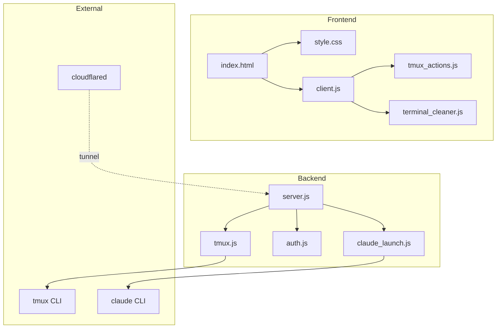
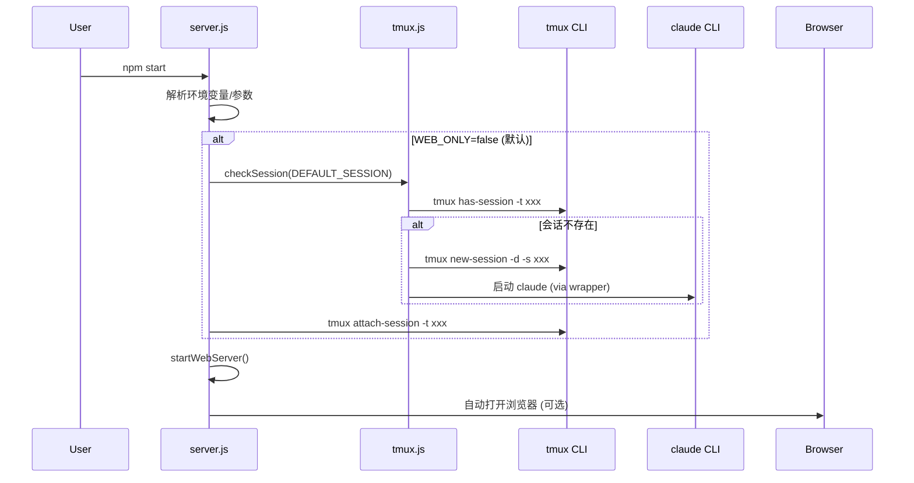
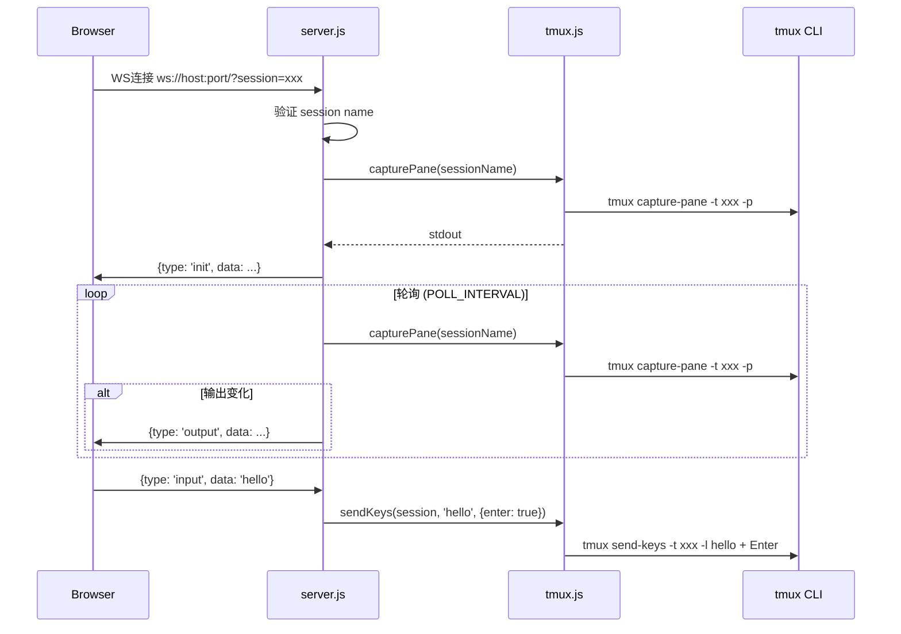

# cc-web-control 仓库深度走读报告

> 生成日期: 2026-03-31
> 分析版本: main (025d294)
> 目标读者: 开发者 / 架构师 / 运维

---

## 目录

1. [项目概述](#1-项目概述)
2. [全局架构地图](#2-全局架构地图)
3. [入口与执行流程](#3-入口与执行流程)
4. [核心模块深挖](#4-核心模块深挖)
5. [上手实操与二次开发](#5-上手实操与二次开发)
6. [仓库文档总结](#6-仓库文档总结)
7. [评分与改进建议](#7-评分与改进建议)
8. [附录](#附录)

---

## 1. 项目概述

### 1.1 项目定位

**cc-web-control** 是一个通过 Web 页面远程控制本地 tmux 会话的工具，专门为 Claude Code CLI 设计。它实现了终端镜像功能，让用户可以通过浏览器与 Claude Code 进行交互。

### 1.2 核心价值

- **远程访问**: 通过 Cloudflare Tunnel 实现安全的公网访问
- **实时同步**: WebSocket 实现终端输出的实时镜像
- **多会话管理**: 支持多项目/多 tmux 会话切换
- **安全鉴权**: 可选的 Token 认证机制

### 1.3 技术栈

| 层级 | 技术选型 |
|------|----------|
| 运行时 | Node.js (>= 14) |
| Web 框架 | Express 4.18 |
| 实时通信 | WebSocket (ws 8.16) |
| 终端复用 | tmux (>= 3.0) |
| 外网隧道 | Cloudflare Quick Tunnel (cloudflared) |

---

## 2. 全局架构地图

### 2.1 目录结构

```
cc-web-control/
├── server.js                 # 主入口：HTTP + WebSocket 服务
├── tmux.js                   # tmux 控制封装
├── auth.js                   # 认证与安全工具
├── claude_launch.js          # Claude 启动命令构建
├── claude-wrapper.sh         # Claude CLI 包装脚本
├── package.json              # 项目配置
├── public/                   # 前端静态资源
│   ├── index.html           # 主页面
│   ├── login.html           # 登录页
│   ├── style.css            # 样式 (支持深色模式)
│   ├── client.js            # WebSocket 客户端逻辑
│   ├── tmux_actions.js      # tmux 操作序列构建
│   ├── terminal_cleaner.js  # 终端输出清洗
│   └── logo.png             # 应用图标
├── scripts/
│   └── restart_tunnel.sh    # 一键启动隧道脚本
├── test/                     # 单元测试
│   ├── auth.test.js
│   ├── claude_launch.test.js
│   ├── terminal_cleaner.test.js
│   └── tmux_actions.test.js
└── docs/                     # 文档
    ├── 部署使用文档.md
    ├── 操作手册.md
    ├── prd/                  # 产品需求文档
    └── plan/                 # 迭代计划
```

### 2.2 模块依赖关系


```mermaid
graph TB
    subgraph "Frontend"
        HTML[index.html]
        CSS[style.css]
        CLIENT[client.js]
        ACTIONS[tmux_actions.js]
        CLEANER[terminal_cleaner.js]
    end

    subgraph "Backend"
        SERVER[server.js]
        TMUX[tmux.js]
        AUTH[auth.js]
        LAUNCH[claude_launch.js]
    end

    subgraph "External"
        TMUX_CMD[tmux CLI]
        CLAUDE_CMD[claude CLI]
        CLOUDFLARED[cloudflared]
    end

    HTML --> CSS
    HTML --> CLIENT
    CLIENT --> ACTIONS
    CLIENT --> CLEANER

    SERVER --> TMUX
    SERVER --> AUTH
    SERVER --> LAUNCH

    TMUX --> TMUX_CMD
    LAUNCH --> CLAUDE_CMD

    CLOUDFLARED -.->|tunnel| SERVER
```

### 2.3 入口点与装配点

| 入口类型 | 文件路径 | 符号名 | 说明 |
|---------|---------|--------|------|
| 主入口 | `server.js:619-624` | 顶层执行 | 根据 `WEB_ONLY` 选择启动模式 |
| Web 服务 | `server.js:223-616` | `startWebServer()` | Express + WebSocket 服务器 |
| 会话初始化 | `server.js:155-218` | `initAndAttachSession()` | tmux 会话创建与 Claude 启动 |
| 前端入口 | `client.js:653-714` | `init()` | DOM 加载后初始化 WebSocket |

---

## 3. 入口与执行流程

### 3.1 启动流程


```mermaid
sequenceDiagram
    participant User
    participant Server as server.js
    participant TmuxJS as tmux.js
    participant TmuxCLI as tmux CLI
    participant Claude as claude CLI
    participant Browser

    User->>Server: npm start
    Server->>Server: 解析环境变量/参数

    alt WEB_ONLY=false (默认)
        Server->>TmuxJS: checkSession(DEFAULT_SESSION)
        TmuxJS->>TmuxCLI: tmux has-session -t xxx
        alt 会话不存在
            TmuxJS->>TmuxCLI: tmux new-session -d -s xxx
            TmuxJS->>Claude: 启动 claude (via wrapper)
        end
        Server->>TmuxCLI: tmux attach-session -t xxx
    end

    Server->>Server: startWebServer()
    Server->>Browser: 自动打开浏览器 (可选)
```

### 3.2 WebSocket 通信流程


```mermaid
sequenceDiagram
    participant Browser
    participant Server as server.js
    participant TmuxJS as tmux.js
    participant TmuxCLI as tmux CLI

    Browser->>Server: WS连接 ws://host:port/?session=xxx
    Server->>Server: 验证 session name
    Server->>TmuxJS: capturePane(sessionName)
    TmuxJS->>TmuxCLI: tmux capture-pane -t xxx -p
    TmuxJS-->>Server: stdout
    Server->>Browser: {type: 'init', data: ...}

    loop 轮询 (POLL_INTERVAL)
        Server->>TmuxJS: capturePane(sessionName)
        TmuxJS->>TmuxCLI: tmux capture-pane -t xxx -p
        alt 输出变化
            Server->>Browser: {type: 'output', data: ...}
        end
    end

    Browser->>Server: {type: 'input', data: 'hello'}
    Server->>TmuxJS: sendKeys(session, 'hello', {enter: true})
    TmuxJS->>TmuxCLI: tmux send-keys -t xxx -l hello + Enter
```

### 3.3 HTTP API 流程

| 步骤 | 文件:行号 | 操作 | 说明 |
|-----|-----------|------|------|
| 1 | `server.js:295-313` | `requireAuth` 中间件 | 检查 Cookie/Bearer Token |
| 2 | `server.js:326-338` | `GET /api/sessions` | 列出 tmux 会话 |
| 3 | `server.js:375-402` | `POST /api/sessions` | 创建新会话 |
| 4 | `server.js:404-412` | `DELETE /api/sessions/:name` | 终止会话 |

---

## 4. 核心模块深挖

### 4.1 tmux 控制层 (`tmux.js`)

**概念**: 封装 tmux CLI 为 Promise API，提供会话生命周期管理。

**核心数据结构**:
```javascript
// 会话信息 (listSessions 返回)
{
  name: string,        // 会话名
  attached: boolean,   // 是否有客户端连接
  createdEpoch: number, // 创建时间戳
  created: string      // 格式化的创建时间
}
```

**关键函数**:

| 函数 | 位置 | 用途 | tmux 命令 |
|-----|------|------|----------|
| `runTmux()` | :8-42 | 底层 spawn 封装 | - |
| `checkSession()` | :49-60 | 检查会话存在 | `tmux has-session -t <name>` |
| `createSession()` | :67-87 | 创建后台会话 | `tmux new-session -d -s <name>` |
| `capturePane()` | :94-112 | 捕获终端内容 | `tmux capture-pane -t <name> -p` |
| `sendKeys()` | :120-141 | 发送文本 | `tmux send-keys -l <text>` + Enter |
| `sendKey()` | :175-190 | 发送单个按键 | `tmux send-keys <key>` |
| `killSession()` | :148-164 | 终止会话 | `tmux kill-session -t <name>` |

**扩展点**: 如需支持窗口分割，在此模块添加 `splitWindow()`、`selectPane()` 等函数。

### 4.2 认证安全层 (`auth.js`)

**概念**: 提供认证原语，防时序攻击，防 CSRF。

**关键函数**:

| 函数 | 位置 | 用途 |
|-----|------|------|
| `parseCookieHeader()` | :3-18 | 解析 Cookie 字符串 |
| `safeEqual()` | :20-27 | 时序安全字符串比较 |
| `extractBearerToken()` | :29-36 | 提取 Bearer Token |
| `isAuthorized()` | :38-50 | 综合认证检查 |
| `isSameOrigin()` | :52-66 | Origin 校验防 CSRF |
| `normalizeNextPath()` | :68-82 | 安全的重定向路径处理 |

**安全特性**:
- 使用 `crypto.timingSafeEqual` 防止时序攻击
- 拒绝协议相对 URL (`//evil.com`)
- 过滤 NULL 字节和 CRLF 防止注入

### 4.3 前端操作序列构建 (`tmux_actions.js`)

**概念**: 构建 tmux 操作的原子序列，解决 Web 输入与 tmux 行同步问题。

**核心模式**: 先清行 (`C-u`)，再输入，最后决定是否回车。

```javascript
// Tab 补全示例
buildTabComplete('/model')
// => [
//   { type: 'key', data: 'C-u' },      // 清空当前行
//   { type: 'input', data: '/model', enter: false }, // 输入不回车
//   { type: 'key', data: 'Tab' }       // 触发补全
// ]
```

**API 列表**:

| 函数 | 用途 |
|-----|------|
| `buildClearLine()` | 清空当前输入行 |
| `buildSyncLine(text)` | 同步输入（不提交） |
| `buildSubmitLine(text)` | 提交命令 |
| `buildTabComplete(text)` | Tab 补全 |
| `buildSyncAndKey(text, key)` | 同步后发送按键 |

### 4.4 终端输出清洗 (`terminal_cleaner.js`)

**概念**: 清理 ANSI 转义序列，提供干净的文本显示。

**处理流程**:
1. 移除 CSI 序列 (`\x1b[...m`)
2. 移除 OSC 序列 (`\x1b]...`)
3. 统一换行符
4. 过滤分隔线和空提示符

### 4.5 隧道部署脚本 (`restart_tunnel.sh`)

**概念**: 一键启动服务 + Cloudflare Tunnel，自动生成 Token。

**执行流程**:
1. 生成 16 字节随机 Token
2. 创建 tmux 会话 `cc-web-control`
3. Window `server`: 启动 Node 服务
4. Window `tunnel`: 启动 cloudflared
5. 轮询等待 URL 生成

**环境变量**:

| 变量 | 默认值 | 用途 |
|-----|--------|------|
| `CC_WEB_TMUX_SESSION` | `cc-web-control` | tmux 会话名 |
| `CC_WEB_PROXY_URL` | (空) | 可选代理 |
| `CC_WEB_CLOUDFLARED_PROTOCOL` | `http2` | 隧道协议 |

---

## 5. 上手实操与二次开发

### 5.1 依赖清单

**运行时依赖** (`dependencies`):
- `express: ^4.18.2` - Web 框架
- `ws: ^8.16.0` - WebSocket 实现

**开发依赖** (`devDependencies`):
- `nodemon: ^3.0.0` - 热重载开发

**系统依赖**:
- Node.js >= 14
- tmux >= 3.0
- claude CLI
- cloudflared (外网访问时)

### 5.2 最小启动示例

```bash
# 1. 安装依赖
npm install

# 2. 本地开发
npm run dev

# 3. 生产模式（带隧道）
./scripts/restart_tunnel.sh
```

### 5.3 必需配置项

| 配置项 | 环境变量 | 默认值 | 说明 |
|-------|----------|--------|------|
| 端口 | `CC_WEB_PORT` | `7684` | HTTP/WS 监听端口 |
| 监听地址 | `CC_WEB_HOST` | `127.0.0.1` | 绑定的网卡地址 |
| 认证 Token | `CC_WEB_AUTH_TOKEN` | (空) | 留空则禁用认证 |
| 项目根目录 | `CC_WEB_PROJECT_ROOTS` | (空) | 逗号分隔的目录列表 |

### 5.4 常见坑与排查

| 问题 | 原因 | 解决方案 |
|------|------|----------|
| `tmux exited with code 1` | tmux 未安装或不在 PATH | `brew install tmux` / 检查 PATH |
| WebSocket 频繁断开 | cloudflared 超时 | 使用 `--protocol http2` |
| 命令面板无响应 | Web 输入与 tmux 不同步 | 检查 `tmux_actions.js` 同步逻辑 |
| Token 认证失败 | Cookie 未正确设置 | 检查 `SameSite`/`Secure` 属性 |

### 5.5 二次开发扩展点

#### 扩展点 1: 新增 tmux 操作

**位置**: `tmux.js`

```javascript
// 示例：添加窗口分割支持
async function splitWindow(sessionName, direction = 'h') {
  await runTmux(['split-window', `-${direction}`, '-t', sessionName]);
}
```

#### 扩展点 2: 新增 API 端点

**位置**: `server.js` (在 `startWebServer()` 内)

```javascript
// 示例：添加会话重命名 API
app.patch('/api/sessions/:name', async (req, res) => {
  const { newName } = req.body;
  // 调用 tmux rename-session
});
```

#### 扩展点 3: 前端插件机制

**位置**: `public/client.js`

```javascript
// 可通过全局钩子扩展输入处理
window.ccWebHooks = {
  beforeSend: (type, data) => { /* 预处理 */ },
  afterRender: (output) => { /* 后处理 */ }
};
```

---

## 6. 仓库文档总结

### 6.1 推荐阅读顺序

| 文档 | 用途 | 读者 |
|-----|------|------|
| `README.md` | 快速开始 | 所有人 |
| `docs/部署使用文档.md` | 生产部署 | 运维 |
| `docs/操作手册.md` | 功能详解 | 用户 |

### 6.2 PRD 文档

| PRD | 功能 |
|-----|------|
| `PRD-0001` | Web UX 对齐 |
| `PRD-0002` | 安全隧道远程访问 |
| `PRD-0003` | 会话一致性 |

### 6.3 代码规范（从代码推断）

- **模块化**: 单一职责，每个模块 < 200 行
- **错误处理**: 所有 Promise 都有 try-catch
- **安全优先**: 使用 `timingSafeEqual`，校验所有用户输入
- **测试覆盖**: 核心模块有对应测试文件

---

## 7. 评分与改进建议

### 7.1 评分维度 (100 分制)

| 维度 | 分数 | 证据 |
|-----|------|------|
| **代码质量** | 88/100 | 模块化良好，错误处理完善，但有少量重复代码 |
| **测试覆盖** | 75/100 | 核心模块有测试，但集成测试缺失 |
| **文档完整性** | 90/100 | README + 部署文档 + PRD + 操作手册齐全 |
| **安全性** | 85/100 | Token 认证、CSRF 防护、时序安全比较 |
| **可维护性** | 92/100 | 代码结构清晰，依赖极少，易于理解 |
| **性能** | 80/100 | 轮询方式有开销，可考虑事件驱动 |
| **可扩展性** | 82/100 | 模块化设计支持扩展，但缺少插件机制 |
| **运维友好** | 88/100 | 一键脚本、健康检查端点、日志输出 |
| **总分** | **85/100** | |

### 7.2 Top 改进建议

| 优先级 | 建议 | 影响 | 成本 |
|--------|------|------|------|
| P0 | 添加集成测试（WebSocket 端到端） | 高 | 中 |
| P1 | 实现事件驱动替代轮询（tmux hooks） | 中 | 高 |
| P1 | 添加请求限流 (rate limiting) | 高 | 低 |
| P2 | 支持 HTTPS 直接监听（开发环境） | 低 | 低 |
| P2 | 添加日志级别配置 | 中 | 低 |
| P3 | 前端 TypeScript 迁移 | 低 | 高 |

### 7.3 技术债务

1. **重复的 shell 转义函数**: `server.js:64-70` 与 `claude_launch.js:1-7` 重复定义
2. **硬编码的轮询间隔**: 可考虑动态调整
3. **缺少请求 ID**: 日志追踪困难

---

## 附录

### A. 环境变量速查表

| 变量 | 默认值 | 说明 |
|-----|--------|------|
| `CC_WEB_HOST` | `127.0.0.1` | 监听地址 |
| `CC_WEB_PORT` | `7684` | 监听端口 |
| `CC_WEB_SESSION` | `claude-web-session` | 默认 tmux 会话 |
| `CC_WEB_POLL_INTERVAL` | `100` | 轮询间隔 (ms) |
| `CC_WEB_PROJECT_ROOTS` | (空) | 项目根目录列表 |
| `CC_WEB_AUTH_TOKEN` | (空) | 认证 Token |
| `CC_WEB_CLAUDE_CONTINUE` | `0` | 继续 last session |
| `CC_WEB_WEB_ONLY` | `0` | 仅 Web 模式 |
| `CC_WEB_NO_OPEN` | `0` | 不自动打开浏览器 |
| `CC_WEB_NO_ATTACH` | `0` | 不附加 tmux |
| `CC_WEB_WS_PING_INTERVAL` | `30000` | WS ping 间隔 (ms) |

### B. API 端点速查

| 方法 | 路径 | 用途 | 认证 |
|-----|------|------|------|
| GET | `/healthz` | 健康检查 | 否 |
| GET | `/api/config` | 获取配置 | 是 |
| GET | `/api/sessions` | 列出会话 | 是 |
| POST | `/api/sessions` | 创建会话 | 是 |
| DELETE | `/api/sessions/:name` | 删除会话 | 是 |
| GET | `/api/projects` | 列出项目 | 是 |
| GET | `/login` | 登录页 | 否 |
| POST | `/login` | 登录提交 | 否 |
| POST | `/logout` | 登出 | 是 |
| GET | `/*` | 静态资源 | 是 |
| WS | `/?session=xxx` | WebSocket 连接 | 是 |

### C. 测试命令

```bash
# 运行所有测试
npm test

# 运行单个测试
node --test test/auth.test.js
```

---

*报告由 Claude Code 生成*
